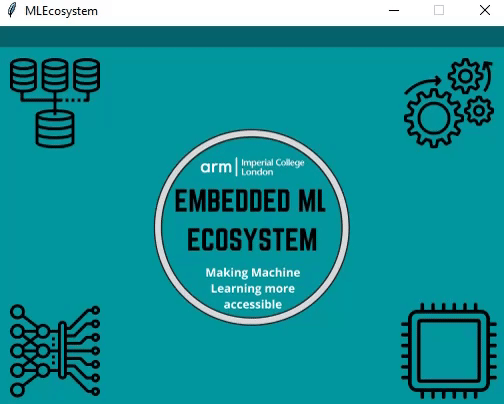

# EMILY

Embedded Machine Learning Ecosystem (EMLE -> EMILY) is an intuitive, beginner-friendly platform aimed at simplifying the creation and deployment of machine learning models on embedded devices.

Our simple, easy-to-use User Interface (UI) guides the user through the entire pipeline required for constructing an audio classifier and deploying it to a microcontroller. This includes selecting a dataset, choosing and tuning the audio processing methods, configuring ML-related parameters for the model training, and finally directly uploading their models to Arduino for running inference, without the need for manual steps in the Arduino IDE. Our application is an all-in-one package.

Tested Operating Systems: Windows 10, MacOS (partial support)

Tested Arduino Boards: [Arduino Nano 33 BLE Sense](https://store.arduino.cc/arduino-nano-33-ble-sense)

## How to run:
Run the main.py python script.

### Requirements:
pip install the following:

| package                       | version |
|-------------------------------|:-------:|
| python                        |  3.8.8  |
| numpy                         |  1.19.5 |
| tensorflow                    |  2.5.0  |
| tensorflow-model-optimization |  0.5.0  |
| librosa                       |  0.8.0  |
| matplotlib                    |  3.3.4  |
| hexdump                       |   3.3   |
| pyserial                      |   3.5   |

## Usage

## Repository breakdown:

### UI: 
This folder contains what would be considered our "end product". Made up of the following:

1. **main.py:** Main UI frontend file. Everything from the backend is called from here.

3. **imports.py:** Contains all imports currently used.

4. **scripts (folder):** Contains all scripts that form the backend, and is divided further into four folders which represent the four blocks in the pipeline:
      1. **dataset:** Contains everything related to accessing and loading the audio dataset. Achieves the following:
            1. Choose the source of the dataset. Options: load from local directory, download from URL, create from within our UI
            2. Set important dataset parameters, such as the expected track duration and the sampling rate

      3. **processing:** Contains everything related to preprocessing the audio dataset. Achieves the following:
            1. Choose the signal processing method. Options: Averaging, Short Time Fourier Transform, Windowed Root Mean Square
            2. Configure processing by tuning algorithm parameters
            3. Option to streamline the input pipeline
            
      5. **training:** Contains everything related to training, converting, and saving the model. Achieves the following:
            1. Set various ML-related parameters
            2. Choose between Convolutional and Dense models.
            2. Real-time plotting of model performance
            3. Model quantization and quantization-aware
            5. Convert model to form readable by the microcontroller and save it in user-selected destination

      7. **arduino:** Contains everything related to deploying the arduino script as well as the model chosen for inference. Achieves the following:
            1. Compile and upload ready-made Arduino script for preprocessing and inference. 
            2. Pass dataset and processing parameters to Arduino through the model file.
            3. Automated deployment to microcontroller through  Arduino-CLI.
            4. Live feedback from the CLI through a custom CMD.

8. **arduino_files (folder):** Contains the .ino script and the .h model file to be uploaded to the arduino.
9. **Images (folder):** Contains images used as icons within the UI.

## Authors: 
- Andreas Floros
- Bharat Kumar
- Hussain Kurabadwala
- Vasileios Manginas
- Stacey Wu
